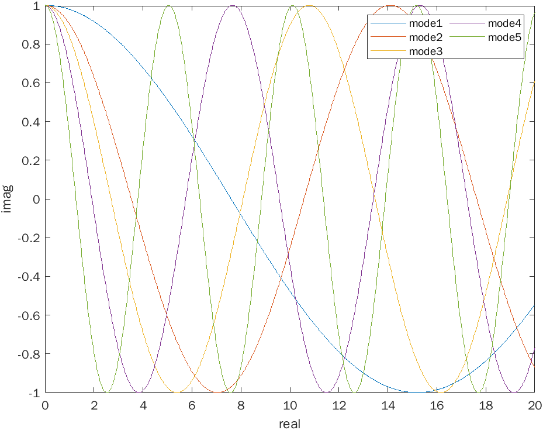

# Mechanical Vibration
This repo is a project for the analysis, study and design of mechanical vibrations.  The topics include one dimensional motion of elastic continuum, traveling waves, standing waves, energy flux, and the use of Fourier integrals. Problem statement in dynamic elasticity, uniqueness of solution, basic solution of elastodynamics, integral representations, steady state time harmonic response. Elastic waves in unbounded medium, plane harmonic waves in elastic half-spaces, reflection and transmission at interfaces, Rayleigh waves, Stoneley waves, slowness diagrams, dispersive waves in waveguides and phononic composites, thermal effects and effects of viscoelasticity, anisotropy, and nonlinearity on wave propagation.

## Multi Degree of Freedom Vibration

## Theory

The K matrix is a mathematical representation of the manner in which the springs of this system
are connected, and how they respond to each other. K for the system in Figure1 is shown in equation two, which is also symmetric.
{width=250}
Fundamental formula to the solution (simplified) from our class is given by the fourier series and green's functions as:
$$ F(t) = \sum_{n=-N}^N c_p \exp \left( \frac{i 2\pi n t}{T_0}\right) $$
where 
$$ c_n = \frac{1}{T_0} \int_{0}^{2} f(t) \exp \left( \frac{-i 2\pi n t}{T_0}\right) \mathrm{d}t $$
and
$$ x(t) = \sum_{n=-N}^N C_p|G_p|\exp \left( \frac{i 2\pi n t}{T_0}-\phi_p\right) $$ 

Now consider a system of coupled oscillators with masses defined in Figure1, as well as the coupling springs defined. 

We have five carts and five springs
Solving for the normal modes and normal frequencies of this system is best accomplished using matrix methods, which is shown in the following equations. The mass matrix (M) of the system is shown in equation one. This matrix is symmetric and diagonal.

$$
Mx^{\cdot }+Kx=0\\
\left ( K-\omega ^{2}M\right) A=0\\
det  \left( K-\omega ^{2}M\right) =0\\
$$
Since the masses are unforced and undamped the matrix A is given by s :
$$
 A=\begin{bmatrix}
a_{1} \\
a_{2} \\
a_{3} \\
a_{1} \\
a_{5}\\
\end{bmatrix}
$$
Let's set app our matrix equation as follows;
$$
\begin{bmatrix}
m_{1} & 0 & 0 & 0 & 0 \\
0 & m_{2} & 0 & 0 & 0 \\
0 & 0 & m _{3} & 0 & 0 \\
0 & 0 & 0 & m _{4} & 0 \\
0 & 0 & 0 & 0 & m _{5}
\end{bmatrix}
\ddot X+\begin{bmatrix}
k_{1}+k_{2} & -k_{2} & 0 & 0 & 0 \\
-k_{2} & k_{2}+k_{3} & -k_{3} & 0 & 0 \\
0 & -k_{3} & k_{3}+k_{4} & -k_{4}& 0 \\
0 & 0 & -k_{4} & k_{4}+k_{5} & -k _{5} \\
0 & 0 & 0 & -k _{5} & k_{5}+k_{6}
\end{bmatrix} \dot X= \begin{bmatrix}
a_{1} \\
a_{2} \\
a_{3} \\
a_{1} \\
a_{5}\\
\end{bmatrix}
$$
Now let's say we have $$ m_{1}=m_{2}=10, m_{3}=5, m_{4}=m_{5}=2; \\ and \\
k_{i}=1 \quad\forall n\in\mathbb 1\leq i\leq5 $$ We can plot find all the natural natural frequencies of the system and plot all the modeshapes as the following write a code in Matlab or Python to produce a graph. 
$$\begin{bmatrix}
10 & 0 & 0 & 0 & 0 \\
0 & 10 & 0 & 0 & 0 \\
0 & 0 & 10 & 0 & 0 \\
0 & 0 & 0 & 10 & 0 \\
0 & 0 & 0 & 0 & 10
\end{bmatrix} 
\ddot X+
\begin{bmatrix}
2 & -1 & 0 & 0 & 0 \\
-1 & 2 & -1 & 0 & 0 \\
0 & -1 & 2 & -1 & 0 \\
0 & 0 & -1 & 2 & -1 \\
0 & 0 & 0 & -1 & 2
\end{bmatrix} \dot X=\begin{bmatrix}
0 \\
0 \\
0 \\
0 \\
0
\end{bmatrix}
$$
Graph 2. Shows all the modes this spring mass system will vibrate. 

The graph below shows a 3D plot with real and imaginary parts in Matalb.

And finally we can check the orthogonality of the system by creating a modal matrix. They are indeed diagonal.

